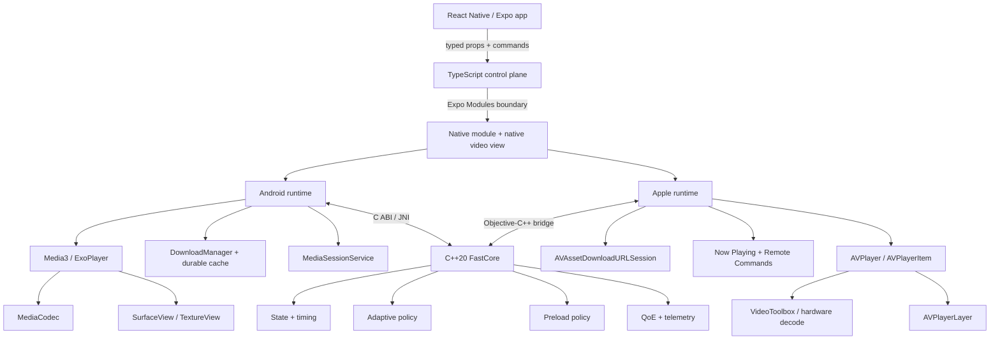
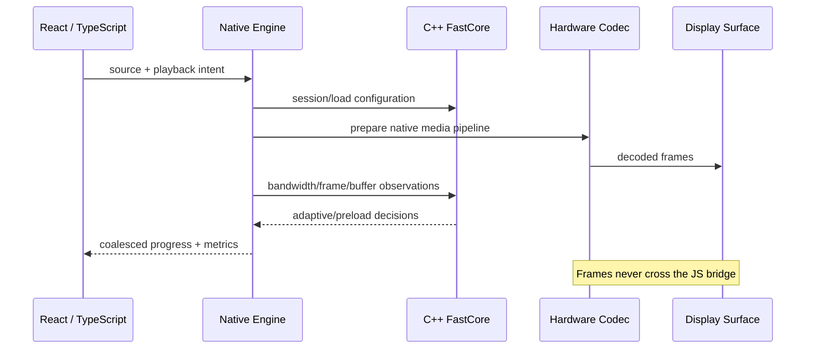
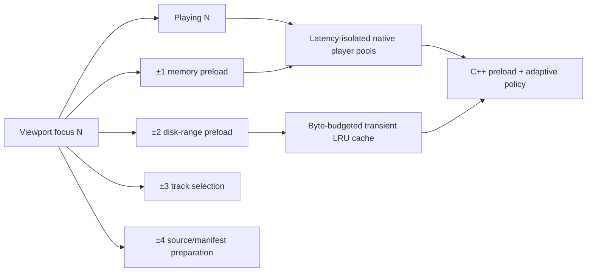
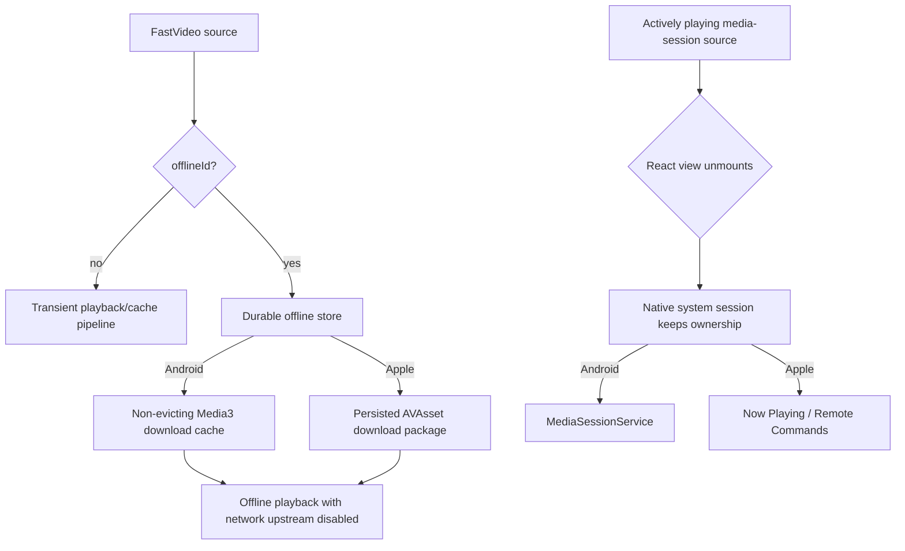
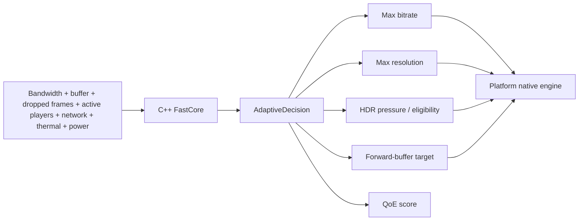

# react-native-fast-video

A performance-first native video runtime for React Native and Expo.

> **Status: early alpha.** The architecture and first native playback slice are implemented, but the project does not claim to be the fastest player until reproducible device benchmarks prove it.

## Design goals

- Hardware-accelerated playback with the shortest practical render path.
- Native ownership of playback, adaptation, timing, tracks, DRM and telemetry.
- A shared C++20 core for deterministic state, buffer policy and metrics.
- Thin TypeScript APIs for composition, controls and application integration.
- Expo development-build support through Expo Modules and a config plugin.
- Honest capability detection for 4K, HDR, DRM and live streaming.

## Implemented

- Android: progressive, HLS and DASH playback through Media3/ExoPlayer.
- Apple: progressive and HLS playback through `AVPlayer`/`AVPlayerLayer`.
- Shared C++ session state machine, buffer profiles and performance metrics.
- Play, pause, seek, replay, rate, volume, mute, repeat and go-to-live commands.
- Native progress, buffering, first-frame, tracks, errors and metrics events.
- Widevine configuration on Android and a FairPlay resource-loader path on iOS.
- Audio/text track discovery and selection.
- SurfaceView-first Android rendering with TextureView as an explicit option.
- Picture-in-Picture entry points and AirPlay/external playback on Apple.
- Typed `<FastVideo />` API, imperative ref, controller hook and optional controls.
- Expo config plugin, example app, C++ tests and benchmark budget gate.
- Native feed preloading: Media3 `DefaultPreloadManager` on Android and retained/warmed `AVURLAsset`s on Apple.
- Phase 3 startup runtime: Android LRU disk cache, disk-range preloading, latency-isolated ExoPlayer pools, AVPlayer pooling and cold/warm TTFF classification.
- Phase 4 native intelligence: C++ adaptive bitrate/resource policy, thermal/network adaptation, QoE scoring, durable offline downloads, media sessions, lock-screen/headset controls, and background playback ownership.
- Phase 5 predictive runtime: smoothed bandwidth forecasting, scroll-intent preload prediction, health-ranked multi-CDN failover, frame-processing diagnostics, and predictive/device benchmark gates.

See [Feature Matrix](docs/FEATURE_MATRIX.md) for exact platform status and caveats.

## Install during development

```bash
npm install react-native-fast-video expo-modules-core
npx expo prebuild
```

This package contains native code and therefore requires an Expo development build; it cannot run inside the stock Expo Go client.

## Basic usage

```tsx
import { FastVideo, type FastVideoRef } from 'react-native-fast-video';
import { useRef } from 'react';

export function Player() {
  const player = useRef<FastVideoRef>(null);

  return (
    <FastVideo
      ref={player}
      style={{ width: '100%', aspectRatio: 16 / 9 }}
      source={{
        uri: 'https://example.com/master.m3u8',
        type: 'hls',
        latencyMode: 'balanced',
      }}
      autoplay
      contentFit="contain"
      onMetrics={(metrics) => console.log(metrics)}
    />
  );
}
```

## Native feed preloading

```tsx
import { preloadFastVideoSources } from 'react-native-fast-video';

await preloadFastVideoSources(
  feed.map((source, preloadIndex) => ({ ...source, preloadIndex })),
  focusedIndex
);
```

Pass the same `preloadIndex` on the `<FastVideo />` source. Android uses Media3's native preload manager; Apple reuses warmed `AVURLAsset` instances. See [Native preloading](docs/PRELOADING.md).

For scrolling feeds, update native priority without rebuilding the preload list:

```ts
import { focusFastVideoPreloads } from 'react-native-fast-video';

await focusFastVideoPreloads(currentVisibleIndex);
```

Sources can also recover entirely in native code using `fallbackUris`, `maxRetryAttempts`, and `retryBackoffMs`, avoiding JS remount/retry loops during CDN failures. See [Phase 2 runtime hardening](docs/PHASE2_RUNTIME.md).

### Runtime cache and pool configuration

Configure Phase 3 before mounting players so Android can construct Media3 with the requested disk-cache budget:

```ts
import {
  configureFastVideoRuntime,
  getFastVideoRuntimeStats,
  clearFastVideoCache,
} from 'react-native-fast-video';

await configureFastVideoRuntime({
  cacheMaxBytes: 512 * 1024 * 1024,
  maxPooledPlayersPerMode: 2,
});

console.log(await getFastVideoRuntimeStats());
```

Android uses a byte-bounded `SimpleCache`. Apple reports `cacheBudgetControllable: false` because public AVFoundation APIs do not provide an equivalent HLS media-cache byte budget; it still pools `AVPlayer`s and warmed `AVURLAsset`s. See [Phase 3 runtime](docs/PHASE3_RUNTIME.md).

## Phase 4 native intelligence

```ts
import {
  configureFastVideoRuntime,
  downloadFastVideoOffline,
  listFastVideoOfflineDownloads,
  stopFastVideoBackgroundPlayback,
} from 'react-native-fast-video';

await configureFastVideoRuntime({
  adaptiveMode: 'balanced',
  cacheMaxBytes: 512 * 1024 * 1024,
  maxPooledPlayersPerMode: 2,
  maxParallelDownloads: 3,
});

await downloadFastVideoOffline(source, { id: 'movie-42', title: 'Movie 42' });
console.log(await listFastVideoOfflineDownloads());
```

Set `mediaSession: true` and optional `metadata` on a source to opt into native system controls/background ownership. In Expo, configure the plugin with `{ "backgroundPlayback": true }`. Android uses a Media3 media session and durable DownloadManager store; Apple uses Now Playing/remote commands and background HLS VOD asset downloads. FastCore emits `qoeScore` and `onAdaptiveDecision` exposes policy changes. See [Phase 4 plan](docs/PHASE4_PLAN.md) and [runtime architecture](docs/PHASE4_RUNTIME.md).


## Phase 5 predictive runtime

Feed focus can now carry scroll velocity so native preloading aims ahead of the viewport instead of reacting only after an item becomes visible:

```ts
const intent = await focusFastVideoPreloads(visibleIndex, velocityItemsPerSecond);
console.log(intent.predictedIndex, intent.confidence);
```

`onMetrics` now includes `predictedBandwidthBps`, `bandwidthConfidence`, `bandwidthVolatility`, and frame-processing diagnostics. Source fallback origins are health-ranked natively using success/failure and startup history; exported diagnostics contain only the origin, never path/query credentials. See [Phase 5 runtime](docs/PHASE5_RUNTIME.md).

## Performance contract

Performance is measured, not asserted. The benchmark harness tracks:

- time to first frame;
- seek completion latency;
- rebuffer count and ratio;
- rendered and dropped frames;
- live-edge distance;
- estimated throughput and bytes transferred;
- JS event frequency and bridge overhead;
- memory, CPU and thermal behavior in device runs.

See [Performance](docs/PERFORMANCE.md).

## Architecture

`react-native-fast-video` is intentionally built as a **native media runtime with a React Native control surface**. JavaScript composes UI and issues low-frequency commands; it never sits in the frame, decode, adaptive-bitrate, cache, retry, or download hot path.



### Hot-path ownership



### Feed / short-video pipeline

The feed path is optimized around **reuse before recreation**. Focus changes reprioritize native work; they do not rebuild players in JavaScript.



### Durable offline and background ownership

Transient feed caching and explicit downloads are deliberately separate correctness domains.



### Native intelligence loop



The C++ layer does **not** replace MediaCodec, VideoToolbox, AVPlayer, DRM engines, or platform hardware decoders. Reimplementing those in portable C++ would usually lose hardware acceleration, battery efficiency, platform DRM, and display integration. FastCore instead owns portable decision-making and telemetry while the OS owns the parts it is best at.

For deeper design notes see [Architecture](docs/ARCHITECTURE.md), [Phase 3 runtime](docs/PHASE3_RUNTIME.md), and [Phase 4 runtime](docs/PHASE4_RUNTIME.md).

## License

MIT
