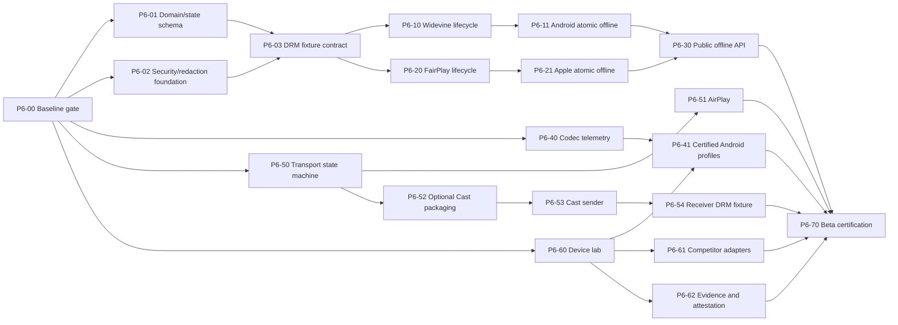

# Phase 6 Implementation Backlog

**Status:** proposed work breakdown; implementation intentionally not started  
**Planning unit:** each work package is intended to fit one reviewable PR or a tightly related PR series.  
**Merge rule:** a package cannot merge merely because code compiles; it must satisfy its listed acceptance and evidence gates.

## 1. Program-level dependency graph



## 2. Proposed source layout

```text
src/
├── offline/
│   ├── FastVideoOffline.types.ts
│   └── FastVideoOfflineModule.ts
├── remote/
│   ├── FastVideoRemote.types.ts
│   ├── FastVideoRouteButton.tsx
│   └── FastVideoRemoteModule.ts
├── decoder/
│   └── FastVideoDecoder.types.ts
└── certification/                 # separate export, lab-only

cpp/
├── include/rnfv/
│   ├── offline_state.hpp
│   ├── transport_state.hpp
│   └── evidence_schema.hpp
└── tests/

android/src/main/java/com/vivekjm/fastvideo/
├── offline/
│   ├── FastVideoOfflineCoordinator.kt
│   ├── FastVideoOfflineRepository.kt
│   ├── FastVideoWidevineOfflineLicenseManager.kt
│   ├── FastVideoWidevineProviderAdapter.kt
│   └── FastVideoOfflineReconciler.kt
├── codec/
│   ├── FastVideoCodecInventory.kt
│   ├── FastVideoCertifiedCodecSelector.kt
│   └── FastVideoDecoderProfileStore.kt
├── remote/
│   └── route-neutral contracts
└── certification/

ios/
├── Offline/
│   ├── FastVideoOfflineCoordinator.swift
│   ├── FastVideoOfflineRepository.swift
│   ├── FastVideoFairPlayKeySessionRuntime.swift
│   ├── FastVideoPersistableKeyStore.swift
│   └── FastVideoOfflineReconciler.swift
├── Decoder/
│   └── FastVideoApplePipelineDiagnostics.swift
├── Remote/
│   ├── FastVideoAirPlayRuntime.swift
│   └── route-neutral contracts
└── Certification/

packages/ or optional native integration/
└── cast/
    ├── android/
    ├── ios/
    ├── src/
    └── plugin/

certification/
├── fixtures/
├── schema/
├── android-benchmark/
├── apple-tests/
├── competitors/
├── report-generator/
└── workflows/
```

The final Cast layout depends on decision P6-D209.

## 3. Foundation work packages

### P6-00 — Baseline and planning gate

**Depends on:** Phase 1–5 hardening PR.  
**Deliverables:**

- hardening merged to `main`;
- all baseline CI jobs green from the merged SHA;
- planning documents approved;
- implementation branch strategy documented;
- Phase 6 labels/milestones/issues created if project management is used.

**Acceptance:**

- no Phase 6 runtime files in this planning PR;
- `main` version/build metadata coherent;
- baseline evidence archived for regression comparison.

### P6-01 — Durable domain model and state machines

**Purpose:** define the portable logical model before platform DRM code.

**Deliverables:**

- versioned offline asset schema;
- versioned license status schema;
- offline state transition validator;
- transport-owner state machine;
- idempotency/operation record model;
- schema migration framework;
- sanitized error taxonomy;
- deterministic C++/TypeScript contract tests.

**Acceptance:**

- illegal transitions are rejected;
- every nonterminal state has a reconciliation action;
- schema round-trip and migration tests pass;
- unknown future fields are handled according to the compatibility rule;
- hostile/non-finite/oversized values are bounded.

### P6-02 — Security, storage, and redaction foundation

**Depends on:** approved storage/account decisions.  
**Deliverables:**

- native secret/redaction utility on Android and Apple;
- protected-record abstraction;
- Keystore-backed Android metadata encryption prototype;
- Keychain/Data Protection Apple storage prototype;
- backup-exclusion policy;
- bridge/event prohibited-field scan;
- logcat/Apple log/evidence secret-scanner corpus;
- storage corruption and key-rotation tests.

**Acceptance:**

- protected records fail closed when tampered/swapped;
- no plaintext test secret remains in app storage after operation;
- backup behavior matches the approved policy;
- logs and bridge records pass automated secret scans;
- key rotation/migration can be rolled back safely.

### P6-03 — Provider adapter and deterministic DRM fixture contract

**Depends on:** P6-01, P6-02, P6-D201, P6-D206.  
**Deliverables:**

- Android Widevine adapter interface and registry;
- Apple FairPlay adapter protocol and registry;
- native credential provider contract;
- deterministic fixture provider with acquire/renew/revoke/release behavior;
- request/response size, redirect, timeout, and parsing policy;
- fake clock and deterministic expiry controls;
- provider conformance suite.

**Acceptance:**

- adapter implementations pass identical lifecycle tests;
- background credential resolution works after process restart;
- no adapter can serialize raw response/key data through public events;
- malformed/oversized/replayed fixture responses fail closed;
- deterministic fixture secrets are never packaged into release builds.

## 4. Android Widevine work packages

### P6-10 — Widevine offline license lifecycle

**Depends on:** P6-03.  
**Deliverables:**

- Media3 `DownloadHelper` preparation path to obtain DRM init data and stream selections;
- `OfflineLicenseHelper` wrapper for acquire/query/renew/release;
- protected storage of key-set identifier;
- duration/expiry normalization;
- renewal returning replacement key-set ID atomically;
- release result/tombstone handling;
- L1/L3/security-level reporting;
- unit/instrumentation tests using fixture provider.

**Acceptance:**

- acquire → restore/query → renew → release works on physical Widevine devices;
- renewal cannot lose the last usable key-set ID on partial failure;
- expired/revoked/missing key-set errors are stable and sanitized;
- helper/session resources always close;
- secure decoder/output restriction is honored.

### P6-11 — Android atomic media/license coordinator

**Depends on:** P6-10.  
**Deliverables:**

- durable coordinator tying license and Media3 download request;
- selected stream keys stored in `DownloadRequest`;
- offline playback MediaItem restores offline key-set ID;
- compensation release after permanent media failure;
- process-death reconciliation worker;
- account/logout policy enforcement;
- pause/resume/remove integration;
- clear-content migration through same coordinator.

**Acceptance:**

- kill/restart at every state boundary reconciles correctly;
- offline playback uses zero media network upstream;
- `ready` requires completed media and usable license;
- media-only/license-only corruption is detected;
- offline removal follows the approved release policy;
- existing clear-content downloads remain compatible or migrate explicitly.

### P6-12 — Android Widevine real-provider certification adapter

**Depends on:** P6-10/P6-11 and real provider access.  
**Deliverables:**

- provider-specific adapter outside generic core;
- CI-safe credential provision;
- renewable/short-lived/revoked fixtures;
- provider rate-limit/retry policy;
- physical device certification report.

**Acceptance:**

- provider test account can be rotated without code changes;
- all provider payloads remain native/redacted;
- certification matrix passes on named L1/L3 devices;
- generic code contains no provider-name conditional.

## 5. Apple FairPlay work packages

### P6-20 — FairPlay persistent-key lifecycle

**Depends on:** P6-03.  
**Deliverables:**

- dedicated `AVContentKeySession` runtime;
- streaming request → persistable request transition;
- SPC generation and provider adapter exchange;
- persistable key creation/storage;
- offline key response during playback;
- updated persistable key atomic replacement;
- invalidation of one/all keys as approved;
- expiry/renewal normalization;
- lifecycle tests on physical device.

**Acceptance:**

- acquire → offline restore → update/renew → invalidate passes;
- unsupported persistable-key streams return stable capability error;
- previous usable key survives failed update;
- key blob never crosses bridge/logs;
- device-lock/storage-protection behavior matches policy.

### P6-21 — Apple atomic asset/key coordinator

**Depends on:** P6-20.  
**Deliverables:**

- durable coordinator tying persistent key and `AVAssetDownloadURLSession` task;
- background task-to-record reconciliation;
- process termination/relaunch handling;
- compensation/invalidation after permanent asset failure;
- account/logout/remove policy;
- corrupt/missing package/key reconciliation;
- existing clear HLS offline migration.

**Acceptance:**

- background completion after termination produces a valid `ready` record;
- package without key and key without package fail safely;
- removal invalidates or queues invalidation according to policy;
- network-disabled offline playback succeeds for valid item;
- restart tests cover every durable state.

### P6-22 — FairPlay real-provider certification adapter

**Depends on:** P6-20/P6-21 and provider access.  
**Acceptance mirrors P6-12**, including renewable, expired, revoked, invalidated, and output-policy fixtures on named physical devices.

## 6. Cross-platform offline API work packages

### P6-30 — Public offline API and events

**Depends on:** P6-11, P6-21.  
**Deliverables:**

- proposed `prepare/get/list/renew/reconcile/remove/pause/resume` API;
- TypeScript types and documentation;
- native event emitter with coalescing;
- opaque ID contract;
- stable error mapping;
- backward-compatible clear API delegation;
- web unsupported behavior;
- example app offline state UI.

**Acceptance:**

- API contract tests run against Android/Apple fake runtimes;
- no key-like field appears in declarations or event payloads;
- list/get reconstruct UI after JS reload;
- duplicate operation IDs are idempotent;
- old clear API compatibility tests pass.

### P6-31 — Offline policy/account management

**Depends on:** approved P6-D202–D205.  
**Deliverables:**

- account scope reconciliation API;
- logout/switch behavior;
- queued release visibility/retry;
- quota/item limit policy;
- migration/version upgrade behavior;
- support/export diagnostics with redaction.

**Acceptance:** approved product-policy scenario suite passes on both platforms.

## 7. Codec intelligence work packages

### P6-40 — Codec/pipeline inventory and normalized telemetry

**Depends on:** baseline only.  
**Deliverables:**

- Android decoder inventory, initialization, fallback, secure/adaptive/tunneled flags;
- Android profile/performance-point/concurrency observations where available;
- Apple public capability/pipeline outcome diagnostics;
- normalized decoder decision event;
- certification-only detailed record and production-minimal record;
- privacy/redaction controls;
- evidence schema support.

**Acceptance:**

- `system` behavior is unchanged;
- telemetry does not increase JS event rate per frame;
- decoder identity is absent when platform API does not expose it;
- no serial/user/content secrets in record;
- long playback telemetry has bounded memory/storage.

### P6-41 — Decoder profile format, verification, and rollback

**Depends on:** P6-40, P6-D212.  
**Deliverables:**

- signed/versioned profile schema;
- exact device/OS/Media3 compatibility keys;
- rule expiry and precedence;
- signature/checksum validation;
- bundled profile loader;
- remote disable/kill-switch path;
- invalid/stale profile tests.

**Acceptance:** untrusted profile cannot inject arbitrary code/class/decoder outside constrained schema; invalid profiles fall back to `system`.

### P6-42 — Android certified codec selector

**Depends on:** P6-41 and device lab.  
**Deliverables:**

- `MediaCodecSelector` wrapper applying exact certified ordering;
- fallback integration;
- secure/tunneled requirement preservation;
- rule outcome telemetry;
- experimental performance/powerSaver policies;
- initial deliberately small certified rule set.

**Acceptance:**

- each rule has physical repeated evidence;
- unmatched devices behave exactly like system default;
- decoder initialization failure falls back;
- rule can be disabled without app update if approved configuration path exists;
- no broad manufacturer wildcard rule in first beta.

### P6-43 — Apple capability/format certification

**Depends on:** P6-40/lab.  
**Deliverables:**

- public capability report for target codecs/HDR/routes;
- fixture-driven AVPlayer outcome matrix;
- bitrate/resolution/buffer policy validation;
- explicit documentation that decoder pinning is unavailable.

## 8. Remote playback work packages

### P6-50 — Route-neutral transport state machine

**Depends on:** P6-01.  
**Deliverables:**

- local/AirPlay/Cast owner state machine;
- transfer snapshot schema;
- generation/idempotency IDs;
- rollback and timeout rules;
- semantic track mapping;
- live seekable-range transfer representation;
- normalized remote errors/events;
- C++/native deterministic race tests.

**Acceptance:** duplicated/out-of-order callbacks never leave two authoritative owners; rollback restores a consistent local state.

### P6-51 — AirPlay first-class integration

**Depends on:** P6-50.  
**Deliverables:**

- `AVRoutePickerView` bridge/component;
- `AVRouteDetector` availability state;
- external-playback active events;
- Now Playing/remote command continuity;
- route-aware metrics;
- PiP/background/interruption handling;
- subtitles/audio/live/HDR/DRM route fixtures.

**Acceptance:** physical Apple TV/AirPlay receiver matrix passes; system output restrictions are obeyed.

### P6-52 — Optional Cast packaging prototype and ADR

**Depends on:** P6-D209.  
**Deliverables:**

- compare sibling package, subspec/property, and plugin dependency injection;
- measure npm install, Expo prebuild, Android/iOS build, binary size, and no-Cast build;
- document selected packaging ADR;
- prove core builds without Cast SDK.

**Acceptance:** selected approach adds zero Cast linkage when disabled and deterministic integration when enabled.

### P6-53 — Cast Android sender runtime

**Depends on:** P6-50/P6-52.  
**Deliverables:**

- CastContext/session manager initialization;
- route button/framework controllers;
- remote media client commands/status;
- Android notification/lockscreen UX;
- reconnect/app relaunch;
- queue/tracks/live DVR;
- transfer transaction and telemetry.

**Acceptance:** sender design checklist scenarios and physical receiver matrix pass.

### P6-54 — Cast iOS sender runtime

**Depends on:** P6-50/P6-52.  
**Deliverables:** equivalent iOS sender/session/remote-media integration, respecting iOS-specific volume/UI limitations.

### P6-55 — Custom Web Receiver authorization/DRM fixture

**Depends on:** P6-53/P6-54, P6-D208.  
**Deliverables:**

- versioned receiver custom-data schema;
- receiver-specific short-lived credential contract;
- reference Custom Web Receiver test fixture;
- DRM request interceptors/provider adapter fixture;
- sender/receiver correlation IDs;
- malicious/oversized custom-data tests;
- token expiry/refresh/revocation scenarios.

**Acceptance:** no mobile DRM header/key data reaches receiver; protected Cast fixture passes on physical hardware.

### P6-56 — Public remote playback API

**Depends on:** AirPlay and Cast prototypes.  
**Deliverables:** route button/picker, transfer methods, remote state/events, capability model, example UI, docs, unsupported web behavior.

## 9. Certification/evidence work packages

### P6-60 — Versioned fixture manifest and fault proxy

**Deliverables:**

- fixture schema and content hashes;
- clear/live/track/error fixtures;
- seeded network/failure profiles;
- server clock/live-edge endpoint;
- no-secret public fixture subset;
- protected fixture access model.

**Acceptance:** repeated fixture ID resolves identical media/hash/policy; fault schedule is seed-reproducible.

### P6-61 — Android physical benchmark harness

**Deliverables:**

- benchmark app/module;
- instrumentation functional suites;
- Macrobenchmark journeys;
- Perfetto capture/trace markers;
- controlled power suite on supported Pixel hardware;
- Firebase Test Lab gcloud workflow;
- artifact collection and schema conversion.

### P6-62 — Apple physical benchmark harness

**Deliverables:**

- XCTest UI/performance targets;
- signpost instrumentation;
- `.xcresult` parser;
- physical-device workflow;
- FairPlay/AirPlay/HDR scenario runner;
- artifact/schema conversion.

### P6-63 — Competitor adapters

**Depends on:** frozen P6-D213.  
**Deliverables:** same-app adapters, version/build metadata, capability declaration, scenario reset semantics, open-source adapter code.

**Acceptance:** adapters pass fairness review before claim-bearing runs.

### P6-64 — Statistical report generator and claim policy

**Depends on:** P6-D214/P6-D215.  
**Deliverables:**

- raw JSONL validator;
- paired block analysis;
- bootstrap confidence intervals;
- P50/P90/P95/P99/failure summaries;
- practical-significance gate;
- claim-policy validator;
- deterministic report generation from raw data.

### P6-65 — Evidence bundle, SBOM, and attestation

**Deliverables:**

- evidence manifest and SHA256SUMS;
- SBOM generation;
- package/binary/evidence provenance attestation;
- separate verification job;
- release asset upload;
- retention/lifecycle procedure.

**Acceptance:** a clean verifier can validate hashes, schema, source revision, and attestations without trusting the generated Markdown report.

## 10. Release work packages

### P6-70 — Capability truth-table and documentation audit

- update README/feature matrix/DRM/offline/remote/Expo docs;
- label every feature implemented/integration-tested/device-certified/provider-certified/experimental/device-dependent/unsupported;
- document minimum OS and provider/device caveats;
- document migration from clear offline API;
- document receiver ownership and decoder limitations.

### P6-71 — Full release-candidate certification

- freeze commit, dependencies, fixtures, device matrix, competitor versions, network profiles, and statistical plan;
- run T0–T4;
- triage every failure without deleting samples;
- produce evidence bundle and reports;
- independent evidence verification.

### P6-72 — Beta release gate

- all claimed feature gates green;
- unresolved scope marked unsupported/deferred;
- security findings resolved;
- package/binaries/evidence attested;
- release notes and known issues approved;
- no broad comparative claim unless claim policy passes.

## 11. Review dimensions for every implementation PR

Each PR must include these sections:

1. **Scope and milestone ID**
2. **Accepted decision IDs**
3. **Threats addressed**
4. **State transitions changed**
5. **Public API/bridge changes**
6. **Key-material boundary statement**
7. **Failure, retry, compensation, and restart behavior**
8. **Feature flag/rollback path**
9. **Host/native/physical tests**
10. **Evidence schema impact**
11. **Compatibility/migration**
12. **Explicitly unsupported cases**

## 12. Merge discipline

- No mega-PR spanning both platform DRM implementations and public API.
- Generic contracts merge before provider-specific adapters.
- Telemetry merges before decoder overrides.
- Route-neutral state machine merges before Cast/AirPlay public API.
- Optional Cast dependency packaging is proven before sender implementation lands.
- Physical fixture/test code lands with or before the feature it certifies.
- A feature can merge behind an experimental flag before device certification, but documentation must remain “experimental,” not “supported.”
- Beta release waits for the complete declared scope, not merely merged source.

## 13. Backlog completion criteria

The backlog is ready to execute when:

- [ ] all P6-D2xx decisions needed by the first workstream are resolved;
- [ ] selected provider fixtures and owners are available;
- [ ] target beta scope is approved;
- [ ] device/lab access is confirmed;
- [ ] Cast packaging prototype decision is scheduled before Cast implementation;
- [ ] evidence repository/retention decision is made;
- [ ] every work package has an issue/owner when implementation begins;
- [ ] no runtime implementation is hidden in the planning branch.
