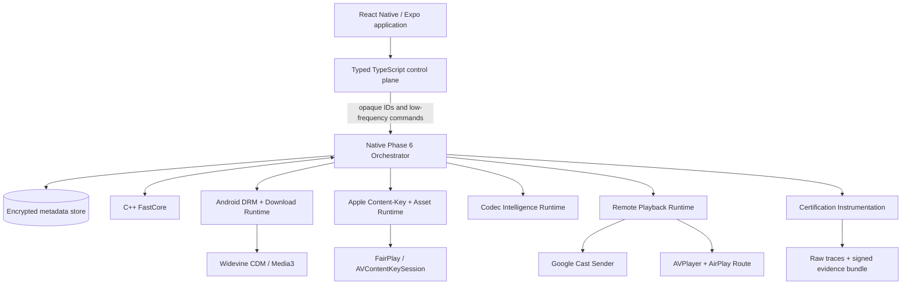
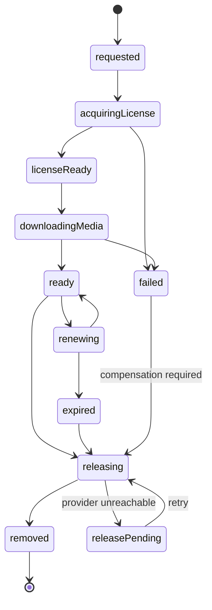
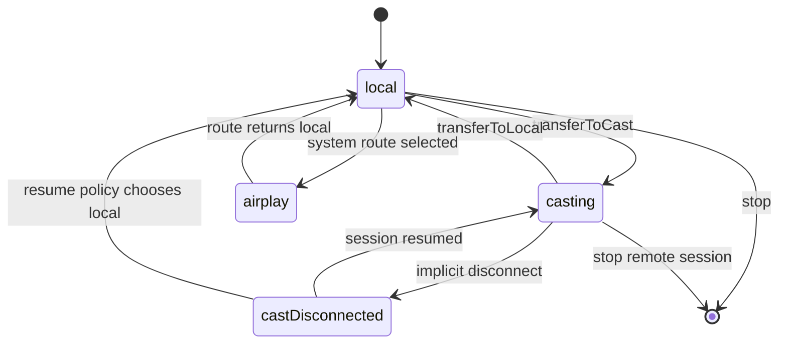

# Phase 6 Master Plan — Certified Advanced Media

**Status:** planning only  
**Target baseline:** Phase 1–5 hardening branch `feat/phase5-gap-closure`  
**Proposed release train:** `0.1.0-beta.x` after certification gates pass  
**Implementation rule:** no Phase 6 runtime code begins until this plan, the API proposal, the threat model, and the certification matrix are reviewed together.

## 1. Why Phase 6 exists

Phases 1–5 created a native media runtime: Media3 on Android, AVFoundation on Apple, C++ FastCore policy and telemetry, Expo integration, preloading, player pools, clear-content offline downloads, media sessions, predictive bandwidth, multi-CDN failover, and benchmark schemas.

Phase 6 changes the standard of proof. The goal is not to add another collection of features and label them complete. The goal is to make advanced capabilities **secure, recoverable, measurable, provider-testable, and supported by reproducible physical-device evidence**.

Phase 6 is complete only when the project can answer all of these questions with artifacts rather than assumptions:

1. Can protected media be downloaded, renewed, played offline, revoked, and securely deleted across process death and device restart?
2. Can decoder policy improve a measured outcome on a known device without making unsupported devices less reliable?
3. Can playback move between local, Cast, and AirPlay routes without losing position, tracks, live-window semantics, or control ownership?
4. Can every performance statement be reproduced from a documented fixture, build, device, network profile, and raw trace?
5. Can a consumer verify that a published report and binary came from the claimed source revision and workflow?

## 2. Baseline gate

Phase 6 is stacked on the Phase 1–5 hardening work. Before the first implementation PR is opened, the baseline must satisfy all of the following:

- Phase 1–5 hardening is merged into `main`.
- Host, Android, and Apple build jobs are green from a clean checkout.
- The package, Android Gradle metadata, CocoaPods metadata, and example app use one version source.
- Clear-content offline download and background-playback tests remain green.
- A release tag can be reproduced without temporary publication files or generated-source drift.

No Phase 6 branch may bypass this gate by copying files from an unmerged branch.

## 3. Non-negotiable design principles

### 3.1 The operating system still owns decoding and DRM

FastCore will not become a software decoder, CDM, or key server. Android MediaCodec/Widevine and Apple AVPlayer/VideoToolbox/FairPlay remain the authoritative execution engines. C++ owns portable policy, state, scoring, and normalized telemetry.

### 3.2 JavaScript never receives key material

Raw Widevine key-set identifiers, FairPlay persistable content keys, SPC/CKC payloads, certificates, or provider secrets must not cross the React Native bridge. TypeScript sees opaque library-generated identifiers and sanitized status only.

### 3.3 Offline media and its license are one logical transaction

A completed media download without a usable license is not `ready`. A license without associated media is not a successful offline item. The orchestrator must compensate after partial failure and reconcile after process death.

### 3.4 Safe system defaults beat clever global overrides

Decoder affinity is evidence-driven and opt-in until a device/profile combination passes certification. One device failure must not create a global blacklist. The default policy remains the platform-preferred decoder with fallback enabled where appropriate.

### 3.5 Remote playback is a different engine, not a mirrored local view

Cast playback executes on a Web Receiver and must have a separate session, error, capability, and telemetry namespace. AirPlay remains an AVPlayer route and therefore shares more local state, but route ownership must still be explicit.

### 3.6 Performance claims require raw evidence

Synthetic fixtures may test the benchmark harness, but they cannot support comparative claims. A claim requires physical-device results, raw samples, environment metadata, confidence intervals, traces, and an attested artifact manifest.

## 4. Phase 6 scope

Phase 6 contains four implementation workstreams and one evidence/release workstream:

1. **Secure offline DRM lifecycle**
   - Widevine offline license acquire/query/renew/release.
   - FairPlay persistable content-key acquire/update/invalidate.
   - Atomic coordination with durable media downloads.
   - Provider-adapter contracts and fixtures.

2. **Codec and decoder intelligence**
   - Android codec inventory and evidence-based ordering.
   - Secure-decoder compatibility and fallback.
   - Apple capability and playback-pipeline observability without pretending AVPlayer exposes public decoder pinning.
   - Device-profile registry generated only from certified runs.

3. **Remote playback orchestration**
   - Optional Google Cast sender integration on Android and iOS.
   - First-class AirPlay route UI and route-state events on Apple.
   - Local-to-remote and remote-to-local transfer semantics.
   - Queue, tracks, live DVR, metadata, error, and session-resume parity.

4. **Physical-device certification lab**
   - Deterministic media/DRM/fault fixtures.
   - Android Macrobenchmark, Perfetto, instrumentation, and controlled power runs.
   - Apple XCTest performance metrics, signposts, and device runs.
   - Competitor adapters using identical scenarios and build settings.

5. **Evidence and release integrity**
   - Versioned result schema and environment fingerprint.
   - Raw traces and normalized summaries.
   - SHA-256 manifest, SBOM, GitHub artifact attestations, and release report.
   - Claim-policy enforcement.

## 5. Explicit non-goals

The following are not Phase 6 deliverables:

- A custom H.264, HEVC, VP9, AV1, Dolby Vision, or audio software decoder.
- Bypassing DRM, HDCP, secure surfaces, output restrictions, or platform policy.
- A production license-server backend or long-lived DRM credentials in the example app.
- Arbitrary offline DRM on web.
- Advertising, editing, transcoding, recording, video effects, or server-side media packaging.
- A generic Cast Web Receiver hosting service operated by this library.
- An Apple decoder selector API that AVPlayer does not publicly provide.
- A “fastest player” badge based on simulator, emulator, or synthetic-only measurements.

## 6. Target architecture



### 6.1 Offline transaction state machine



A state transition is durable before external work starts and finalized only after the platform result is persisted. Every nonterminal state has a process-restart reconciliation rule.

### 6.2 Playback ownership model



There is one authoritative transport at a time. Position, selected tracks, live-window data, and playback intent are captured into a transfer snapshot before ownership changes.

## 7. Workstream A — secure offline DRM lifecycle

### A0. Provider-neutral contract and fixtures

Deliverables:

- Native-only provider adapter contracts for license request transformation and response parsing.
- A deterministic test provider used only in CI/local certification.
- At least one real Widevine provider fixture and one real FairPlay provider fixture before beta certification.
- Fixture capabilities declared as data: renewal, expiration, revocation, persistent-key support, security level, output restrictions, and response encoding.
- No provider-specific branching inside the generic player or TypeScript API.

Gate A0:

- Request/response fixtures are replayable without logging secrets.
- Header and URL redaction tests pass.
- Raw key material is absent from JavaScript events, crash logs, analytics, and persisted JSON.

### A1. Android Widevine lifecycle

Planned native components:

- `FastVideoWidevineOfflineLicenseManager`
- `FastVideoOfflineCoordinator`
- encrypted license metadata repository
- Media3 `DownloadHelper` preparation path for DRM init data and stream selection
- Media3 `OfflineLicenseHelper` lifecycle wrapper
- playback `MediaItem.DrmConfiguration` restoration using the stored offline key-set ID

Operations:

1. Prepare manifest and selected tracks.
2. Obtain DRM initialization data.
3. Acquire the offline license.
4. Store only the key-set identifier in encrypted native storage.
5. Create the `DownloadRequest` with the associated key-set identifier and selected stream keys.
6. Download media into the non-evicting store.
7. Mark `ready` only after media and license checks pass.
8. Query remaining playback/license duration.
9. Renew before the policy threshold.
10. Release through the CDM/provider exchange before deleting local metadata when connectivity permits.
11. Persist `releasePending` when server-confirmed release cannot complete; retry with backoff.

Android failure cases that require explicit tests:

- Process death after license acquisition but before download enqueue.
- Download failure after license acquisition.
- License expiration while offline.
- Renewal returning a new key-set identifier.
- App update with existing downloads.
- CDM reports missing or invalid key-set identifier.
- Widevine L3 device, L1 device, secure-decoder mismatch, and output restriction.
- Provider revocation and server release failure.

### A2. Apple FairPlay persistent-key lifecycle

Planned native components:

- `FastVideoFairPlayKeySessionRuntime`
- `FastVideoPersistableKeyStore`
- `FastVideoOfflineCoordinator`
- background asset-download reconciliation

Operations:

1. Create and retain a dedicated `AVContentKeySession` for the offline operation.
2. Generate SPC with the application certificate and opaque content identifier.
3. Obtain CKC through the provider adapter.
4. Request and process an `AVPersistableContentKeyRequest`.
5. Store persistable key data using file protection and a Keychain-wrapped encryption key.
6. Start or resume `AVAssetDownloadURLSession` only after key readiness.
7. Serve the stored persistable key during offline playback.
8. Replace the previous stored key atomically when the system provides an updated persistable key.
9. Renew before expiration according to provider policy.
10. Invalidate the persistent key when a download is deleted or revoked.

Apple failure cases that require explicit tests:

- Background download completes after app termination.
- Persistable-key request is unsupported for a stream/provider.
- Stored key is present but asset package is missing, and the inverse.
- Key update arrives during an active playback session.
- Expiration occurs during playback.
- Device backup/restore and app reinstall behavior are documented and tested according to the chosen storage policy.
- Deletion while offline queues provider/local invalidation correctly.

### A3. Atomic orchestration and reconciliation

The coordinator owns one durable record per offline item. It must:

- serialize mutually exclusive actions per item;
- use idempotency keys for provider operations when supported;
- make acquire, renew, release, remove, and reconcile idempotent;
- compensate by releasing a license when media preparation/download fails permanently;
- refuse playback when either side of the media/license pair is unusable;
- rebuild in-memory state from native storage after process restart;
- expose only sanitized, stable status through TypeScript.

Gate A:

- Acquire, download, offline playback, expiry, renewal, revocation, deletion, compensation, and process-death suites pass on physical devices.
- No raw key material crosses the bridge or appears in exported artifacts.
- Provider adapter contract passes the deterministic fixture and the selected real provider fixtures.

## 8. Workstream B — codec and decoder intelligence

### B0. Inventory and telemetry before policy

Record, per playback session:

- requested MIME type, codec string, profile, level, bit depth, dimensions, frame rate, HDR metadata, and secure-decoder requirement;
- selected decoder identity when exposed;
- hardware/software/secure/adaptive/tunneled capability flags where available;
- initialization latency, fallback count, first-frame latency, frame drops, processing offset, rebuffer ratio, thermal state, and fatal decoder errors;
- concurrent decoder/player count;
- OS build, device model, app/library version, and experiment profile.

Never persist signed media URLs, authorization headers, content identifiers, or DRM payloads in codec evidence.

### B1. Android evidence-driven selector

Android can inject a `MediaCodecSelector`, so Phase 6 may reorder decoder candidates only under a certified profile.

Policies:

- `system`: platform/Media3 default ordering; production default.
- `certified`: apply a signed device-profile rule generated from repeated certification results.
- `performance`: experimental profile favoring measured TTFF/frame performance.
- `powerSaver`: experimental profile favoring measured energy/thermal behavior.

Rules:

- secure-decoder and tunneling requirements are never weakened;
- fallback remains enabled unless a certification profile proves a stronger rule;
- a candidate is demoted only for an exact evidence key, not a broad manufacturer prefix;
- stale profiles expire by OS build/library compatibility range;
- remote configuration may disable a profile but may not inject arbitrary decoder names;
- every non-system selection records its rule ID and fallback outcome.

### B2. Apple observability and policy

AVPlayer does not expose an Android-equivalent public decoder ordering API. Phase 6 therefore treats Apple decoder work as:

- format and HDR capability detection;
- AVPlayer/VideoToolbox outcome telemetry available through public APIs;
- bitrate, resolution, forward-buffer, route, and power/thermal adaptation;
- fixture-driven validation that the OS-selected pipeline meets declared support.

The public cross-platform API must not imply that iOS can pin a decoder by name.

Gate B:

- `system` remains behaviorally unchanged.
- Every certified override shows repeatable improvement or reliability benefit on its exact device/profile key.
- No regression beyond the release budget on devices without a matching profile.
- Secure DRM playback, HDR, multi-player feeds, background/foreground, and thermal pressure are included in the matrix.

## 9. Workstream C — remote playback orchestration

### C0. Packaging decision

Google Cast SDKs must be optional so applications that do not cast do not pay dependency, binary-size, manifest, or initialization cost.

Proposed packaging:

- core package: local playback, AirPlay integration, route-neutral interfaces;
- optional Cast integration package/subspec/Gradle feature enabled by the Expo config plugin;
- receiver application remains application-owned and configured by receiver app ID.

### C1. Google Cast sender runtime

The sender runtime must own:

- Cast context/session initialization;
- route picker and framework-provided controls;
- session lifecycle, implicit disconnect, and reconnection;
- `RemoteMediaClient` load, play, pause, seek, rate, queue, track, volume, and live status;
- local-to-Cast and Cast-to-local transfer snapshots;
- remote errors and sanitized diagnostics;
- Android notification/lock-screen integration required by Cast UX guidance.

DRM rule:

- protected Cast playback requires an application-owned Custom Web Receiver and a receiver-specific authorization contract;
- mobile DRM headers, offline key identifiers, or FairPlay/Widevine key material are never forwarded blindly to the Web Receiver;
- sender and receiver tokens are separate, short-lived credentials.

### C2. AirPlay runtime

AirPlay is implemented as a first-class Apple route around AVPlayer:

- expose an `AVRoutePickerView`-backed component/action;
- use `AVRouteDetector` for route availability hints;
- emit route-availability and active-route state;
- preserve Now Playing and remote-command behavior;
- distinguish local rendering from external playback in telemetry;
- validate subtitles, alternate audio, live HLS, PiP interaction, background playback, and route interruption.

### C3. Transfer contract

Every transfer snapshot includes:

- media identity and remote-authorized URL request contract;
- VOD position or live seekable-window-relative position;
- play/pause intent and rate;
- selected audio/text tracks by semantic identity, not platform-native index;
- queue position and repeat behavior;
- metadata and artwork reference;
- correlation ID linking local and remote telemetry.

Gate C:

- route controls follow platform UX requirements;
- implicit disconnect reconnects without creating two authoritative players;
- explicit disconnect versus stop-casting semantics are distinct;
- VOD, live DVR, tracks, queue, error, and app-relaunch scenarios pass on physical receiver hardware;
- DRM Cast fixtures pass through the Custom Web Receiver contract.

## 10. Workstream D — physical-device certification lab

### D0. Fixture service

Fixtures must be deterministic, versioned, and content-addressed. Required families:

- clear progressive MP4: H.264, HEVC where supported, AV1 where supported;
- HLS and DASH ladders with aligned renditions;
- live HLS/DASH with DVR windows and controllable latency;
- LL-HLS fixture;
- 1080p, 1440p, and 4K variants;
- SDR, HDR10, HLG, and Dolby Vision only where licensing and devices permit;
- Widevine CENC/cbcs and FairPlay fixtures with renewable, short-lived, expired, and revoked policies;
- multi-CDN aliases with deterministic delay, reset, HTTP error, corruption, and bandwidth shaping;
- alternate audio, forced subtitles, WebVTT/TTML, discontinuities, gaps, and malformed-manifest negatives.

Every fixture release includes manifest hashes and a capability manifest.

### D1. Android harness

Use separate layers:

- instrumentation tests for functional playback/DRM/route behavior;
- Macrobenchmark for end-user journeys and frame/startup distributions;
- Perfetto traces for diagnosis and release evidence;
- controlled Pixel physical devices for power measurements;
- Firebase Test Lab for broad functional device/OS coverage.

### D2. Apple harness

Use:

- XCTest UI tests for functional and transfer journeys;
- `XCTClockMetric`, `XCTCPUMetric`, `XCTMemoryMetric`, `XCTHitchMetric`, and `XCTOSSignpostMetric` where applicable;
- named signposts for source assignment, item ready, first frame, seek, stall, route transfer, key acquisition, and offline readiness;
- physical-device runs for HDR, FairPlay, AirPlay, energy, thermal, and long-duration behavior.

### D3. Competitor comparison harness

Competitors are integrated through adapters in the same benchmark app. The rules are:

- same app shell, release build, source URL, device, route, network profile, and screen brightness;
- identical autoplay/preload/cache policy where capabilities overlap;
- cold and warm runs are separate;
- execution order is randomized or counterbalanced;
- all failures remain in the dataset;
- at least 30 valid samples for claim-bearing scenarios unless the statistical plan justifies another count;
- publish median, P90/P95, dispersion, confidence interval, failure rate, and raw samples;
- do not combine unsupported competitor features into a favorable aggregate score.

Gate D:

- PR smoke, nightly matrix, and release-certification tiers are operational.
- Raw artifacts are downloadable and schema-valid.
- Re-running a release scenario from its manifest produces results within the documented noise envelope.

## 11. Workstream E — evidence, attestation, and release

The release evidence bundle contains:

```text
phase6-evidence/
├── manifest.json
├── environment.json
├── fixture-manifest.json
├── results/
│   ├── raw/*.jsonl
│   ├── normalized/*.json
│   └── summaries/*.json
├── traces/
│   ├── android/*.perfetto-trace
│   └── apple/*.trace-or-xcresult
├── reports/
│   ├── certification.md
│   ├── compatibility.md
│   └── comparison.md
├── sbom/
└── SHA256SUMS
```

Release workflow requirements:

- build from an immutable commit/tag;
- generate package tarball and example binaries;
- generate SBOM;
- hash every evidence artifact;
- create GitHub artifact provenance/SBOM attestations;
- verify the attestation in a separate workflow step;
- publish a machine-readable certification status and human-readable report;
- block comparative marketing language unless the claim-policy job passes.

## 12. Proposed milestone and PR sequence

Phase 6 is intentionally a sequence of reviewable PRs rather than one long-lived mega-branch.

| Milestone | Purpose | Required before merge |
|---|---|---|
| P6-00 | Finalize plan, API, threat model, certification matrix | Documentation review; no runtime code |
| P6-01 | Native offline transaction schema and provider adapter contracts | State-machine and redaction tests |
| P6-02 | Android Widevine acquire/query/renew/release | Deterministic provider + physical Widevine fixture |
| P6-03 | Android atomic media/license orchestration | Process-death and compensation suite |
| P6-04 | Apple FairPlay persistent-key lifecycle | Persistent-key fixture + physical device |
| P6-05 | Apple atomic asset/key orchestration | Background/relaunch/reconciliation suite |
| P6-06 | Public offline DRM API and migration | Cross-platform contract tests and docs |
| P6-07 | Codec inventory and telemetry | No selector overrides yet; evidence schema green |
| P6-08 | Android certified decoder profiles | Physical matrix and rollback controls |
| P6-09 | AirPlay route API and certification | Physical route/interrupt/PiP tests |
| P6-10 | Optional Cast sender package | Sender UX, reconnect, queue/live/track tests |
| P6-11 | Custom Web Receiver DRM contract fixture | Receiver auth/DRM integration tests |
| P6-12 | Device-lab and competitor adapters | Reproducibility and statistical review |
| P6-13 | Attested evidence and beta release gate | Full release matrix and claim policy |

Dependencies:

- P6-02 and P6-04 depend on P6-01.
- P6-03 depends on P6-02; P6-05 depends on P6-04.
- P6-06 depends on both platform orchestrators.
- P6-08 depends on P6-07 and the device lab.
- P6-10 is optional-package work and must not block local playback builds.
- P6-13 depends on every scope item claimed by the beta release; deferred optional items must be explicitly marked unsupported.

## 13. Feature flags and rollback

Every high-risk subsystem ships behind native configuration:

- `offlineDrmEnabled`
- `decoderPolicy`
- `castEnabled`
- `certificationTelemetryEnabled`

Requirements:

- defaults preserve Phase 5 behavior;
- disabling a feature does not strand existing offline items without a documented migration path;
- remote configuration can disable an experimental policy but cannot inject secrets or executable rules;
- decoder profiles are signed/versioned data bundled with a release or downloaded from a trusted application endpoint;
- every experiment has a kill switch and a stable fallback path.

## 14. Risk register

| Risk | Consequence | Mitigation |
|---|---|---|
| Provider-specific DRM assumptions leak into core | One provider works, others fail | Native adapter contract + two-provider certification target |
| License acquired but media fails | Paid entitlement stranded | Durable state machine + compensating release |
| Media deleted before license release | Server entitlement leak | `releasePending` tombstone and retry |
| Raw key material reaches JS/logs | Security incident | Native-only key boundary + redaction tests + threat-model gate |
| Decoder override regresses another OS build | Playback failures | Exact profile keys, expiry, fallback, remote kill switch |
| Cast duplicates local playback | Double audio and inconsistent controls | Single transport owner and transfer transaction |
| Cast receiver accepts mobile credentials | Credential exposure | Receiver-specific short-lived authorization contract |
| Device-farm noise creates false claim | Misleading benchmark | controlled runs, raw samples, confidence intervals, no farm power claims |
| Optional Cast SDK bloats all apps | Adoption regression | optional package/subspec/plugin-controlled dependency |
| Evidence cannot be tied to source | Unverifiable release | immutable revision, hashes, SBOM, artifact attestation |

## 15. Definition of done

Phase 6 is complete only when all applicable statements are true:

### Correctness

- Offline DRM lifecycle is atomic, idempotent, restart-safe, and tested for expiry, renewal, revocation, deletion, and partial failure.
- Local, Cast, and AirPlay playback have one authoritative owner and deterministic transfer behavior.
- Decoder intelligence never violates secure-decoder or platform capability requirements.

### Security

- No raw key material crosses the bridge or appears in logs/artifacts.
- Persisted DRM metadata is encrypted and protected according to the threat model.
- Receiver authorization is separate from mobile playback authorization.
- Dependency, SBOM, secret-scan, and redaction gates pass.

### Compatibility

- Minimum supported Android/iOS versions remain explicitly documented.
- Clear playback, feeds, clear offline downloads, PiP, media sessions, and Expo builds retain Phase 5 behavior.
- Applications that do not enable Cast have no Cast runtime dependency.

### Evidence

- Required physical-device matrices pass.
- Every release result validates against the versioned schema.
- Raw samples and traces accompany summaries.
- Evidence and distributable artifacts have verifiable provenance attestations.

### Claims

- Documentation distinguishes implemented, certified, experimental, device-dependent, and unsupported capabilities.
- No comparative claim is published unless the exact scenario, competitors, sample count, statistical result, and evidence bundle are public.

## 16. Decisions that must be approved before implementation

1. The reference Widevine and FairPlay provider fixtures used for certification.
2. Whether offline licenses survive logout, app reinstall, device backup/restore, and account switch.
3. The exact deletion policy when the device is offline and provider release cannot complete.
4. Whether Cast ships as a sibling npm package, CocoaPods subspec, Gradle opt-in, or a combination.
5. The application-owned Custom Web Receiver contract and hosting responsibility.
6. The first physical-device matrix and the devices reserved for controlled power/thermal runs.
7. The competitors and scenarios allowed in public comparison reports.
8. The statistical thresholds and regression budgets used to block release.
9. The beta scope: all Phase 6 workstreams, or a declared subset with the rest explicitly deferred.

## 17. Official research basis

- [Android Media3 OfflineLicenseHelper](https://developer.android.com/reference/androidx/media3/exoplayer/drm/OfflineLicenseHelper)
- [Android Media3 DefaultDrmSessionManager](https://developer.android.com/reference/androidx/media3/exoplayer/drm/DefaultDrmSessionManager)
- [Apple AVContentKeyRequest](https://developer.apple.com/documentation/avfoundation/avcontentkeyrequest)
- [Apple: Downloading and playing HLS offline](https://developer.apple.com/videos/play/wwdc2020/10655/)
- [Android MediaCodecSelector](https://developer.android.com/reference/androidx/media3/exoplayer/mediacodec/MediaCodecSelector)
- [Android DefaultRenderersFactory](https://developer.android.com/reference/androidx/media3/exoplayer/DefaultRenderersFactory)
- [Google Cast Android sender integration](https://developers.google.com/cast/docs/android_sender/integrate)
- [Google Cast iOS sender integration](https://developers.google.com/cast/docs/ios_sender/integrate)
- [Google Cast Web Receiver overview](https://developers.google.com/cast/docs/web_receiver)
- [Apple AirPlay integration](https://developer.apple.com/documentation/avfoundation/supporting-airplay-in-your-app)
- [Firebase Test Lab](https://firebase.google.com/docs/test-lab)
- [Android Macrobenchmark metrics](https://developer.android.com/topic/performance/benchmarking/macrobenchmark-metrics)
- [Apple XCTest metrics](https://developer.apple.com/documentation/xctest/xctmetric)
- [GitHub artifact attestations](https://docs.github.com/en/actions/how-tos/secure-your-work/use-artifact-attestations/use-artifact-attestations)
