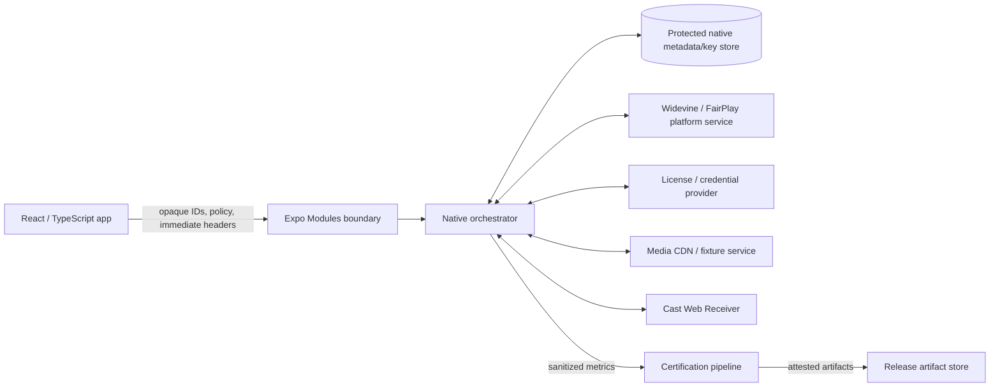

# Phase 6 Threat Model

**Status:** planning baseline  
**Scope:** offline DRM, native credential/provider adapters, durable downloads, decoder profiles, remote playback, certification telemetry, and release evidence.

## 1. Security objectives

Phase 6 must preserve these properties:

1. Content keys and platform license handles remain inside native/platform security boundaries.
2. JavaScript receives no raw DRM key material or replayable license payload.
3. Offline entitlement state is account-scoped, durable, and revocable according to application policy.
4. Removing an offline item does not silently abandon a provider release obligation.
5. Cast receiver authorization is separate from mobile playback authorization.
6. Logs, metrics, crash reports, benchmark traces, and evidence bundles contain no secrets or protected URL credentials.
7. Decoder-profile and remote-configuration data cannot inject executable code or arbitrary native class/codec names from an untrusted source.
8. Release artifacts and evidence can be tied to a source revision and build workflow.

## 2. Security non-goals and assumptions

The library does not claim to:

- defeat a fully compromised operating system, kernel, rooted/jailbroken device, or malicious instrumentation with equivalent privileges;
- replace Widevine/FairPlay hardware/CDM protections;
- guarantee provider-side entitlement correctness;
- protect media after the platform legitimately outputs decoded frames to an allowed display path;
- bypass screen-capture, HDCP, or output-policy decisions made by the platform/provider;
- operate a production DRM license service or Cast Web Receiver hosting service;
- keep application-provided secrets secure if the host application deliberately logs or exports them.

The design assumes:

- TLS is correctly configured by provider/fixture endpoints;
- the host app authenticates users and supplies short-lived authorization through an approved credential adapter;
- Android Keystore, Apple Keychain/Data Protection, platform DRM, and secure decoder paths are available according to device capability;
- the application declares its logout, reinstall, backup, and account-switch policy before enabling persistent licenses.

## 3. Assets

### 3.1 Highest sensitivity

- FairPlay persistable content-key data.
- Widevine offline key-set identifier and any data sufficient to restore a license.
- SPC, CKC, Widevine request/response bodies.
- provider authorization tokens and cookies.
- native credential-provider secrets.
- application certificate private material, if any provider architecture uses it. The FairPlay application certificate itself may be distributed, but associated secrets and credentials remain protected.

### 3.2 Sensitive operational data

- protected content identifiers;
- signed media/license URLs and query parameters;
- account-scope identifiers;
- offline entitlement status and expiration;
- device security level and output-restriction status;
- Cast receiver authorization tokens;
- device/decoder fingerprints that could become identifying when combined.

### 3.3 Integrity-sensitive data

- offline transaction state;
- media/license association;
- decoder certification profiles;
- fixture manifests;
- benchmark raw samples and summary reports;
- release artifact hashes, SBOM, and attestations.

## 4. Trust boundaries

Boundary rules:

- key material may cross `NATIVE ↔ DRM` and `NATIVE ↔ STORE`, never `NATIVE → BRIDGE`;
- provider request/response bodies remain native and are excluded from telemetry;
- JavaScript may pass immediate short-lived headers, but background renewal requires a native credential provider;
- Cast receives receiver-specific authorization, not copied mobile DRM headers;
- certification receives normalized/sanitized observations only.

## 5. Threat actors

- malicious or compromised media/license endpoint;
- network attacker able to observe, delay, replay, or modify traffic where TLS validation is defeated;
- malicious JavaScript dependency or application code running in the host process;
- local attacker with app-container access through backup, debugging, malware, or device compromise;
- malicious Cast receiver or another sender on the network;
- compromised CI dependency/action or artifact store;
- accidental developer/operator leakage through logs, screenshots, traces, fixtures, or support exports;
- abusive input source attempting memory, storage, CPU, or download exhaustion.

## 6. Data classification and bridge policy

| Data | Native memory | Protected native storage | JavaScript | Logs/evidence |
|---|---:|---:|---:|---:|
| Widevine key-set ID | yes | encrypted | no | no |
| FairPlay persistable key | yes | encrypted + file protection | no | no |
| SPC/CKC/license body | transient | no by default | no | no |
| provider auth token | transient | only through approved secure provider | immediate header possible, discouraged for background | no |
| offline asset ID | yes | yes | yes | yes |
| license status/expiry | yes | yes | sanitized | sanitized |
| signed media URL | yes | metadata only if required and protected | source input | origin/hash only |
| decoder name | yes | certification profile | sanitized | yes, with device privacy policy |
| account scope | yes | protected/pseudonymous | opaque value | hashed or omitted |

A bridge contract test must fail if a new native event or record exposes a field named or typed as key, keySet, CKC, SPC, certificate bytes, response body, authorization, cookie, or raw request headers unless explicitly reviewed.

## 7. Offline DRM threats and mitigations

### T1. Raw key material crosses the bridge

**Attack:** malicious JS, analytics SDK, or devtools reads key material.  
**Mitigations:**

- native-only key and license manager classes;
- public API uses opaque asset IDs;
- static contract scan of bridge records/events;
- runtime redaction assertion in debug/certification builds;
- no generic `toMap()`/JSON serialization of native DRM objects.

### T2. License metadata stolen from local storage

**Attack:** attacker copies app container or backup and reuses license metadata.  
**Mitigations:**

- Android: encrypt key-set identifiers/metadata with an app-specific Keystore-backed key; bind associated data to package/account/asset schema;
- Apple: store persistable key files using strong Data Protection and encrypt with a Keychain-wrapped key when practical;
- exclude sensitive stores from backup unless a reviewed restore design exists;
- rotate storage schema/key on security migration;
- treat key-set identifiers as secrets even though content keys remain in the CDM.

### T3. Media and license state diverge

**Attack/failure:** media exists without usable license, license exists without media, or metadata points to the wrong pair.  
**Mitigations:**

- one durable transaction record;
- cryptographic/content-addressed media/fixture identity where available;
- store platform handle and media download ID under one asset ID;
- reconciliation on startup/foreground;
- refuse `ready` until both checks pass;
- compensation release for permanently failed media operations.

### T4. License replay or duplicate acquisition

**Attack/failure:** repeated commands acquire multiple entitlements/licenses.  
**Mitigations:**

- operation/idempotency ID;
- per-asset serialized native actor/mutex;
- durable in-flight state before network request;
- provider idempotency header/key when supported;
- reconcile existing platform license before reacquire.

### T5. Release is skipped when deletion occurs offline

**Attack/failure:** local deletion hides a provider entitlement leak.  
**Mitigations:**

- explicit deletion policy;
- durable `releasePending` tombstone;
- bounded retry/backoff and foreground/background reconciliation;
- retain minimum encrypted metadata required to complete release;
- user-visible sanitized pending status when product policy requires it;
- release completion audit event.

### T6. Expired/revoked item silently streams online

**Attack/failure:** entitlement policy is bypassed by fallback.  
**Mitigations:**

- `offlineId` disables media network upstream;
- no automatic online fallback for protected offline playback;
- stable expired/revoked errors;
- online source transition requires explicit application action and new authorization.

### T7. Background renewal uses stale credentials

**Attack/failure:** persisted bearer token is replayed or leaked.  
**Mitigations:**

- native `credentialProviderId` contract;
- short-lived credentials obtained at operation time;
- no plaintext long-lived token in offline metadata;
- credential response kept in memory only unless host provider uses a reviewed secure cache;
- clock-skew and expiry validation.

### T8. Malicious provider response causes parser or storage abuse

**Attack:** oversized/malformed CKC/license response, compression bomb, invalid fields.  
**Mitigations:**

- strict response-size limits;
- bounded timeouts and redirect policy;
- adapter-specific parsing with explicit raw/base64 rules;
- no unbounded JSON/object recursion;
- fail closed without storing partial key data;
- fuzz provider adapters and parsers.

## 8. Network threats

### 8.1 TLS and endpoint identity

- HTTPS required for production DRM/license endpoints.
- Redirects are disabled or restricted to an explicit allowlist for protected requests.
- Certificate pinning is not forced globally by the library because pinning has operational and rotation risk; a native provider adapter may adopt reviewed pinning.
- Hostname, certificate, timeout, and transport errors are sanitized before bridge emission.

### 8.2 Header leakage across domains

- source headers apply only to the exact media origin/approved redirect policy;
- license headers apply only to the license origin;
- fallback CDN authorization is resolved per candidate, not copied blindly;
- Cast receiver authorization is independently issued;
- cross-origin redirects drop sensitive headers unless the provider adapter explicitly approves them.

### 8.3 Request replay

- use nonce/idempotency/provider fields when supported;
- operation IDs are unique and persisted;
- release/renew responses are bound to asset/provider context;
- provider adapter validates content ID and response association before storage.

## 9. Account, logout, reinstall, and backup threats

The product policy must choose one behavior; ambiguity is unsafe.

### 9.1 Account switch

Threat: account B plays account A’s offline entitlement.  
Mitigations:

- bind record to an opaque `accountScope`;
- require active scope match before playback/renewal;
- on scope change, apply declared `keep`, `suspend`, or `remove` policy;
- never expose another scope’s title/status unless host policy allows it.

### 9.2 Logout

Threat: protected content remains playable after entitlement logout.  
Mitigations:

- host declares logout policy;
- library supports suspend or release/remove transaction;
- background release tombstones survive credential/session teardown;
- lock offline playback before asynchronous cleanup if policy requires immediate revocation.

### 9.3 Reinstall and backup/restore

Threat: restored metadata references invalid platform keys or migrates entitlement to another device.  
Mitigations:

- sensitive files excluded from backup by default;
- records include device/install binding where policy requires;
- orphaned restored records reconcile to unusable/removed rather than reacquiring silently;
- reinstall survival is unsupported unless separately designed and provider-approved.

## 10. Cast and remote playback threats

### T9. Mobile credentials sent to Web Receiver

**Attack:** receiver or network participant steals mobile license/media token.  
**Mitigations:**

- receiver-specific credential provider;
- short-lived audience-bound token;
- never serialize mobile DRM headers, offline handles, CKC/SPC, or stored key data into Cast custom data;
- receiver contract allowlists fields and size.

### T10. Malicious or unexpected receiver

**Attack:** user connects to an untrusted receiver or receiver reports false capability/state.  
**Mitigations:**

- use platform Cast discovery/session SDK;
- receiver application ID is configured and validated;
- DRM requires application-owned Custom Web Receiver;
- treat receiver capability/status as untrusted input;
- sanitize receiver-provided metadata/errors;
- local player remains paused and recoverable until remote load acknowledgement.

### T11. Two authoritative players

**Failure:** local and remote both play audio/video after transfer race.  
**Mitigations:**

- native transfer transaction with explicit owner state;
- pause local before remote commit, retain rollback snapshot;
- complete ownership switch only after remote load/session confirmation;
- timeout rolls back to one known owner;
- idempotent session callbacks and generation IDs.

### T12. Unauthorized sender control

**Threat:** another sender modifies playback.  
**Mitigations:**

- follow Cast multi-sender semantics;
- reflect receiver-authoritative state rather than assuming commands succeeded;
- distinguish disconnect from stop;
- application receiver authorization may bind session/account as appropriate;
- do not treat sender-local UI state as entitlement proof.

### T13. Cast custom data injection

**Attack:** oversized/deep/malicious custom data crashes receiver or leaks information.  
**Mitigations:**

- versioned JSON schema;
- strict size/depth/type limits;
- allowlisted fields;
- no arbitrary HTML/script/URL headers;
- receiver validates all sender data.

## 11. AirPlay threats

AirPlay route selection is system-controlled. Threat controls include:

- use `AVRoutePickerView` rather than custom device impersonation UI;
- obey AVPlayer/FairPlay output restrictions and external-playback status;
- never override HDCP/output policy;
- treat route metadata as display-only and sanitized;
- update Now Playing without protected query parameters;
- handle route loss with one-owner rollback semantics;
- do not claim protected AirPlay support unless provider/device fixture certifies it.

## 12. Decoder-profile threats

### T14. Malicious profile selects unsafe/arbitrary decoder

**Mitigations:**

- JavaScript cannot provide decoder names;
- profile schema accepts only measured rule IDs and exact selectors generated by trusted tooling;
- signed profile manifest and checksum;
- exact device/OS/library compatibility constraints;
- secure/tunneled requirement cannot be weakened;
- Media3 fallback enabled;
- remote kill switch may disable a rule but cannot inject a new decoder.

### T15. Overbroad device fingerprinting

**Threat:** decoder evidence becomes a tracking identifier.  
**Mitigations:**

- evidence uses model/OS/build required for certification, not device serial/advertising ID;
- install/session IDs are random and scoped to test run;
- production telemetry is opt-in and aggregated according to host privacy policy;
- no user account, IP address, or protected content title in decoder records;
- retention limits and deletion policy.

### T16. One bad sample creates a global blacklist

**Mitigations:**

- repeated evidence threshold;
- exact rule key and confidence requirement;
- profile review and expiry;
- default remains `system`;
- automatic runtime fallback after initialization/fatal error;
- record rule outcome for rollback decisions.

## 13. Telemetry and logging policy

### 13.1 Allowed

- origin host after sanitization;
- response/error class;
- elapsed time and byte counts;
- opaque asset/run/session correlation ID;
- decoder name/model/OS in certification context;
- DRM scheme and sanitized security-level/status;
- offline state transition and stage;
- route type and sanitized receiver name only where product policy allows.

### 13.2 Prohibited

- authorization/cookie headers;
- full signed URLs or query strings;
- SPC, CKC, license request/response bodies;
- FairPlay persistent key or Widevine key-set ID;
- application private credentials;
- raw Keychain/Keystore aliases where they reveal account/content identity;
- unredacted content ID/title in public evidence;
- user email, account ID, device serial, advertising ID.

### 13.3 Redaction implementation

- central native redaction library used by Android and Apple adapters;
- structured errors instead of interpolated request objects;
- unit corpus of common token/query/header formats;
- certification job scans logs, `.xcresult`, logcat, Perfetto metadata, JSON, and reports;
- any match blocks artifact publication.

## 14. Storage architecture

### 14.1 Record separation

Keep separate stores for:

1. public/sanitized offline metadata;
2. encrypted platform license-handle metadata;
3. FairPlay persistable-key blobs;
4. clear media download index/cache;
5. queued release tombstones;
6. certification evidence.

A UI/list operation reads only sanitized metadata.

### 14.2 Encryption and associated data

Encrypted records include associated data:

- schema version;
- package/bundle identity;
- opaque asset ID;
- account scope hash where applicable;
- DRM scheme;
- record purpose.

This prevents swapping an encrypted record into another asset/context without detection.

### 14.3 Atomic writes

- write to a new protected file/record;
- fsync/transaction where platform storage supports it;
- verify/decrypt;
- atomically replace active pointer;
- retain previous key until updated key is committed;
- delete previous key only after successful replacement/invalidation policy.

## 15. Denial-of-service and resource abuse

Threats:

- unbounded download count/size;
- huge manifest/track count;
- repeated retry/license loops;
- enormous provider response;
- too many concurrent players/decoders;
- Cast custom-data flooding;
- evidence trace disk exhaustion.

Mitigations:

- configurable global/per-account offline byte and item quotas;
- content-length and free-space checks;
- bounded manifest/track/provider parsing;
- retry budgets and circuit breakers;
- serialized license operations per asset/provider;
- download concurrency limits;
- player/decoder pool caps;
- trace size/time limits and cleanup;
- explicit `E_QUOTA`/`E_RESOURCE_LIMIT` errors.

## 16. Supply-chain threats

### T17. Compromised dependency or build action

Mitigations:

- lockfiles and reproducible clean install;
- pinned/action versions, preferably immutable SHAs for release workflows;
- dependency review and vulnerability scanning;
- minimal GitHub Actions permissions;
- no untrusted PR secrets;
- SBOM generation;
- provenance attestation for distributables and evidence;
- separate verification job/workflow;
- protected release environment and tag policy.

### T18. Evidence tampering

Mitigations:

- raw samples are append-only for a run;
- normalized reports are recomputed from raw data;
- SHA-256 manifest covers every file;
- source/build/fixture hashes recorded;
- artifact attestation and verification;
- invalid/excluded samples remain listed with reason;
- report generator is versioned and included in SBOM/source identity.

## 17. Security test plan

### 17.1 Static/contract tests

- bridge schema contains no prohibited fields;
- source/header/URL sanitizer corpus;
- provider adapter response-size/type limits;
- Cast custom-data schema/depth/size limits;
- decoder-profile signature/schema/expiry validation;
- storage records cannot be swapped across asset/account purpose;
- evidence bundle secret scan.

### 17.2 Dynamic tests

- intercept/mock provider sees only expected headers;
- cross-origin redirect does not forward sensitive headers;
- process kill at every offline state transition;
- corrupt encrypted record/key/file;
- wrong account scope;
- expired/revoked provider response;
- offline remove with queued release;
- malicious Cast receiver status/custom data;
- transfer callback reordering and duplication;
- storage/disk quota exhaustion;
- oversized manifest/license response;
- repeated retry/circuit-breaker behavior.

### 17.3 Device security tests

- Widevine L1/L3 behavior and secure decoder requirement;
- screen-capture/output policy is observed, not bypassed;
- FairPlay persistent-key update/invalidation;
- Keychain/file protection while device is locked where testable;
- Android backup/restore and Apple backup/reinstall behavior according to declared policy;
- rooted/jailbroken detection is application policy, not a security guarantee from this library.

## 18. Incident and revocation readiness

Before beta:

- ability to disable offline DRM acquisition by scheme/provider adapter;
- ability to disable decoder profiles globally or by rule ID;
- ability to disable Cast integration/receiver app ID through application configuration;
- storage schema migration/rotation strategy;
- provider credential/key compromise playbook owned by host application/provider;
- release/yank procedure for compromised package;
- attestation verification instructions;
- documented log/evidence retention and deletion procedure.

## 19. Security acceptance gate

Phase 6 cannot be marked complete until:

- [ ] threat-model review has named owners for every open decision;
- [ ] no raw key material crosses the bridge in static and dynamic tests;
- [ ] encrypted storage and atomic replacement tests pass;
- [ ] logout/account/reinstall/backup policy is documented and tested;
- [ ] provider redirect/header/replay/oversize tests pass;
- [ ] queued release and compensation are restart-safe;
- [ ] Cast receiver authorization is separate and schema-limited;
- [ ] decoder profiles are signed, constrained, expiring, and rollback-safe;
- [ ] logs/traces/evidence pass prohibited-data scanning;
- [ ] SBOM/provenance attestations verify;
- [ ] all known high-severity findings are fixed or Phase 6 release is blocked.

## 20. Open security decisions

1. Exact Android encrypted metadata implementation and key-rotation policy.
2. Exact Apple persistable-key storage: file protection class, Keychain wrapping, backup exclusion, and device-lock behavior.
3. Account/logout/reinstall/backup semantics.
4. Provider credential adapter registration and background execution model.
5. Redirect and optional certificate-pinning policy per provider.
6. Release-pending retention duration and user-visible behavior.
7. Cast receiver token audience/lifetime and custom-data schema.
8. Decoder profile signing key ownership and update channel.
9. Production telemetry opt-in, retention, and privacy documentation.
10. Security review requirements for the first beta and subsequent stable release.
